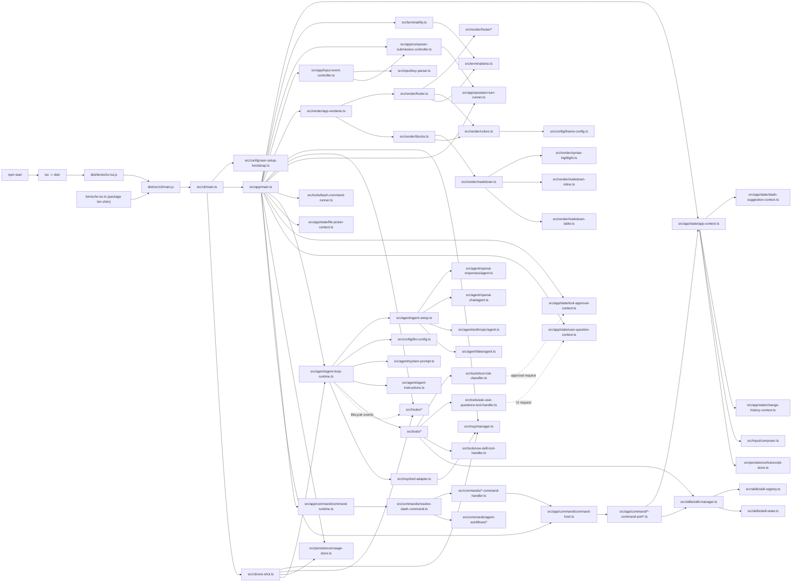
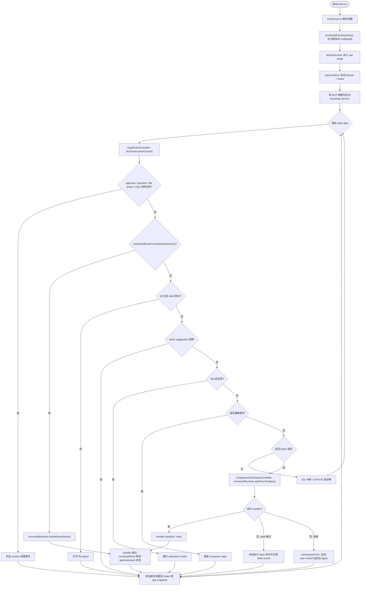
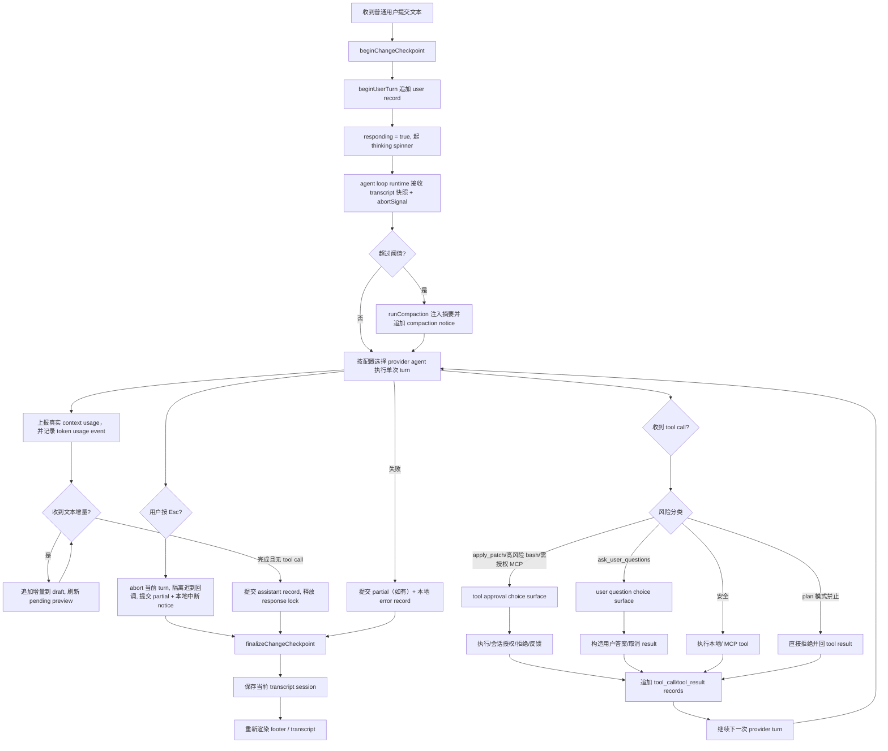
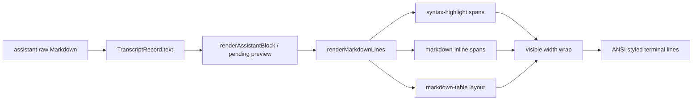
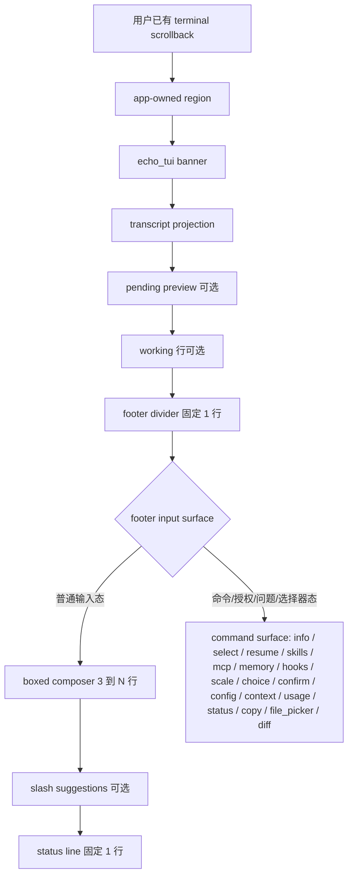

# echo_tui TUI 架构

_面向实现和审阅的终端 TUI 说明。_

---

## 模块架构

`npm start` 通过 `tsc` 生成 `dist/`，再运行 `dist/bin/echo-tui.js`；编译产物使用 CommonJS。`package.json#bin` 指向 `bin/echo-tui.ts`，对应编译产物解析并加载 `dist/src/cli/main.js`；未生成 `dist/` 时给出明确 build 提示并退出。`src/cli/main.ts` 是普通命令行入口：解析 `--help` / `--version` / `--once`，有效启动前执行用户目录初始化（`bootstrapEchoUserSetup`）；无参数时调用 `src/app/main.ts` 的 `run()` 进入 TUI raw mode，`--once` 则交给不创建 terminal、renderer 或 stdin listener 的 `src/cli/one-shot.ts`。`src/types/` 中的纯 TypeScript 文件描述 input、composer、transcript、command、render、app、agent、tool、diff、change-history、mcp 和 skill 的跨层协议。

`src/app/main.ts` 是生产 composition root，面向一个 `AppContext` 组合根；`AppContext` 创建并以只读引用公开 `ComposerContext`、`TranscriptContext`、`ModelContext`、`TurnContext`、`RenderContext`、`ChangeHistoryContext`、`ConversationReferenceContext` 和 `PendingMessageContext`，内部持有 `SlashSuggestionContext` 以及 interaction mode、context usage、MCP bootstrap 状态等进程级标量状态。调用方直接使用状态所属的子 context；`AppContext` 负责派生 render/agent 组合状态，并协调 session 加载与清空、change checkpoint、undo、user/assistant turn 等跨 context 事务。`ToolApprovalContext`、`UserQuestionContext` 和 `FilePickerContext` 由 `main.ts` 直接持有。composer、transcript records、session 指针、response lock、assistant pending、单槽待发送消息、working spinner、输入历史、slash suggestion、change history、status line 和 previous terminal size 由对应 context 或 render state 持有；boxed composer 的 placeholder 只在 render 层生成。`main.ts` 显式装配 terminal、renderer、stores、command runtime、agent runtime 和两个粗粒度 controller，并保留 render/append、shell execution、assistant interruption、MCP/config lifecycle、resize、start 与 exit。`ComposerSubmissionController` 负责 composer 消费、pending dispatch 以及 command/skill/shell/file mention/reference 提交路由；它只把最终 `AssistantTurnSubmission` 交回 main 装配的真实运行边界。`InputEventController` 持有 stateful key parser，按固定优先级协调 modal、local surface、快捷键、composer 和 Esc/Submit/Exit 动作。普通 assistant turn 的 callback 到状态翻译仍由 `src/app/assistant-turn-runner.ts` 承载。具体走 footer-only redraw、transcript append 还是 destructive replay，由 `app-renderer` 门面统一编排。slash command session 和会话内事件分发由 `src/app/command/command-runtime.ts` 承载；`src/app/command/command-host.ts` 在组合根装配领域 command ports。

slash runtime 通过三类稳定边界协调本地命令：

- resolver：决定提交文本是否命中某个 slash handler
- command runtime：启动 handler、保存 command session，并分发活跃会话事件
- command host：向 handler 暴露受控 app 能力，避免 handler 直接依赖 `AppContext` 或 renderer

## 核心运行时概念

| 概念 | 含义 | 实现位置 |
| --- | --- | --- |
| CLI 入口 | 普通命令行入口。解析 `--help` / `--version` / `--once`，有效启动时执行用户目录初始化；无参数进入 TUI，`--once` 进入 headless runner；bin shim 只负责定位编译产物 | `src/cli/main.ts`、`src/cli/one-shot.ts`、`bin/echo-tui.ts` |
| 用户目录初始化 | 首次启动 bootstrap，只在缺失时创建 `~/.echo/config.json`（预置内置 fake agent provider/model）和内置 `echo-tui-setup` skill，不覆盖已有内容 | `src/config/user-setup-bootstrap.ts` |
| interaction mode | 当前进程内的交互模式，含 `normal`、`plan`、`shell`、`shell-local`。Tab 在四者间循环，`/mode` 也可切换；normal/plan 的模型可见切换只包装到切换后首条 user record，plan 同时影响工具风险边界，shell/shell-local 把输入作为本地 bash 命令执行 | `src/app/state/app-context.ts`、`src/types/agent.ts` |
| composer submission controller | 消费 live composer，保护 pending 单槽 claim/dispatch 锁，并依次执行 command、shell、file mention、conversation reference 和 assistant submission 路由；不拥有 agent、renderer 或 shell 进程生命周期 | `src/app/composer-submission-controller.ts` |
| input event controller | 持有跨 stdin chunk 的 key parser，按固定优先级分发 modal、command/local surface、快捷键、composer、Esc、Submit 和 Exit；业务收尾通过 main 装配的必填 action 调用 | `src/app/input-event-controller.ts` |
| slash resolver | 统一的 slash 路由入口。对一段已提交文本按顺序询问 handlers 的 `match()`，命中后直接返回该 handler；未命中则返回 `null` 并回退为普通消息或 shell 命令 | `src/commands/resolve-slash-command.ts` |
| slash handler | 每个本地命令的实例协议对象。至少实现 `match(text)` 和 `start(text, host)`，并暴露用户可见 `name` / `description` 供 slash 提示；交互式命令额外实现 `handleEvent(session, event, host)`。handler 只通过 `CommandHost` 调用受控 app 能力 | `src/commands/*-command-handler.ts` |
| agent workflow | `/init` 和 `/review` 内置工作流。handler 把固定 prompt 通过 `submit_user_message` 交回普通用户消息流程，plan 模式下提交时自动切回 normal；后续走正常 agent lifecycle | `src/commands/agent-workflows/*` |
| slash suggestion context | 普通 composer 输入态的 slash 命令提示状态。基于 handler 元数据和 enabled skill 派生候选项，处理 Up/Down 循环选择和 Tab 补全，不启动 command session | `src/app/state/slash-suggestion-context.ts` |
| active command session | command runtime 显式持有的当前活跃命令会话。表达“某个交互式命令正在接管 footer，并优先消费后续事件” | `src/app/command/command-runtime.ts` |
| command surface | 渲染层可见的统一面板视图模型。renderer 只识别 `info` / `select` / `resume` / `skills` / `mcp` / `memory` / `hooks` / `scale` / `choice` / `confirm` / `config` / `context` / `usage` / `status` / `copy` / `file_picker` / `diff` 等 surface kind，不识别具体命令、工具授权、用户问题或文件选择来源 | `src/types/command.ts`、`src/render/footer/*` |
| command host | command handler 可用的受控 app 协议。app 组合根通过领域 command port factory 装配 transcript、clipboard、model、config、skills、mcp、memory、hooks、mode、theme、context、status、usage、diff、undo、assistant、ui；runtime 把 session open/update/close/getActive 组合进同一个 host。composer 消费统一由 `submitComposer()` 完成，不暴露给 handler | `src/app/command/command-host.ts`、`src/app/command/*-command-port*.ts`、`src/app/command/command-runtime.ts` |
| tool approval context | agent 请求写文件、高风险 shell 或需授权 MCP 工具前的阻塞式授权状态。把授权请求投影为 `choice` surface，支持 Allow once、Allow tool/session、Allow command/session、Allow all/session、Deny 和 Tell model what to do；会话授权缓存由它持有，bash 只按完全相同 command 文本复用授权 | `src/app/state/tool-approval-context.ts`、`src/tools/tool-risk-classifier.ts` |
| user question context | `ask_user_questions` tool 的阻塞式用户问题状态。逐题投影为 `choice` surface，支持预设选项、Other inline 输入和 Esc 取消，最终构造 tool result 交回 agent continuation | `src/app/state/user-question-context.ts`、`src/tools/ask-user-questions-tool-handler.ts` |
| file picker context | composer 内 `@` 文件选择器的 transient 状态。展示当前目录直接子项、查询过滤、文本/代码预览，支持方向键移动、进入/返回目录、Space 多选、Enter 插入 mention，复用 read_files 的资源分类 | `src/app/state/file-picker-context.ts`、`src/input/file-mentions.ts` |
| pending message context | active assistant turn 期间保存一条用户原始文本。`submitComposer()` 在接受 Enter 时统一记录输入历史并清空 composer，pending 自动处理和 turn/command handler 不再修改后来输入的 live 草稿；响应期间输入的 `/reference` 会排队为 command 文本，当前实现不让 pending 携带引用附件。卡片属于有界 footer input surface，第一次 Esc 只移除待发送消息；状态不持久化 | `src/app/state/pending-message-context.ts`、`src/app/composer-submission-controller.ts`、`src/render/footer/composer-surface.ts` |
| status line | 普通输入 footer 底部的一行 segmented 状态。左侧展示当前 session 内存模型、有效推理等级和项目名，右侧展示最近一次真实 provider context usage 与输入/工作模式；普通 redraw/render path 只读 `ModelContext` 缓存。`/model`、`/effort` 和 `Ctrl+T` 立即刷新该缓存并清除旧 usage；sidecar 同步只是静默恢复优化，失败不改变 status line 或阻断请求。`/config` 或 watcher 只刷新全局 catalog/default，当前 profile 仍有效时保持 session 选择，profile 被删除时回退全局默认并清理旧 usage。显式 slash skill 在 active assistant turn 内按字段覆盖 session 展示为 `<model> (SKILL override)`，完成、失败或中断后恢复 session 状态；无效 skill profile 回退 session model。command/approval/user-question/file-picker surface 会替换普通输入区域 | `src/render/footer.ts`、`src/types/render.ts`、`src/app/state/model-context.ts`、`src/app/state/turn-context.ts` |
| transcript store | 按 cwd hash 分区的本地 append-only JSONL session journal。默认根目录是 `~/.echo/echo_tui/`；每个 session 以 `session_start` 首行建立身份，随后逐行追加 records、compaction、todo 和 `/undo` / `/diff` 共用的 change history 操作。同目录 `{session-id}.settings.json` sidecar 原子覆盖当前 model profile ID 和可选 effort override，不保存 profile 定义或历史值；孤立 sidecar 不进入 session 枚举。journal 重放校验 envelope、record role 和下游依赖的关键身份字段，但保留未知扩展字段；display metadata 等可选 payload 由消费端自行校验。重放忽略末尾未完成写入，真正恢复 session 时会原子移除无效尾部后再允许续写，但拒绝中间损坏；不保存 composer、pending、command session 或输入历史 | `src/persistence/transcript-store.ts`、`src/persistence/transcript-journal.ts`、`src/persistence/session-model-settings-store.ts` |
| tool result offloading | 支持大结果的工具把完整已采集文本写入 `~/.echo/echo_tui/projects/<cwd-hash>/tool-results/`，文件先写临时路径再原子落位，单 artifact 默认硬上限 8 MiB。transcript、provider 和 renderer 只接收 bounded preview 与单一 `[tool result truncated: <absolute-path>]` marker；Bash/shell 保留尾部并把 marker 放在输出前，Web Fetch、PDF 已提取文本和 MCP 保留开头并把 marker 放在结果后。PDF 在 `read_files` 最终格式化边界使用独立的 65,536-byte 默认阈值落盘，artifact 保留路径、页数、提取状态和完整已提取文本；普通 `read_files` 结果仍使用 256,000-byte 默认总输出上限，源 PDF 大小与提取内容硬上限保持不变。文件可由现有 `read_files` / `grep` 回读，不写工作区；写入失败退回无路径的既有 bounded 截断。offloading 不取消网络 body、PDF 提取、进程输出、timeout、取消或搜索数量边界；第一版不自动 GC，避免删除历史 transcript 仍引用的文件 | `src/tools/tool-result-offloading.ts`、`src/tools/bash-command-runner.ts`、`src/tools/read-files/tool-handler.ts` |
| usage store | 独立于 transcript 的 append-only JSONL token 用量账本，默认位于用户级 `usage/` 分区，按月份写入并按本地日期聚合；只保存 provider/model/mode/cwd hash 和 token 统计，不保存 prompt、响应文本、工具参数或凭据 | `src/persistence/usage-store.ts`、`src/types/usage.ts` |
| change history context | assistant loop 的 change checkpoint 栈，记录受控文件 snapshot 快照和 `pending` / `created` / `updated` 写入状态；同一份 history 同时服务 `/undo` 回退和 `/diff` fallback | `src/app/state/change-history-context.ts` |
| LLM config | 从 `~/.echo/config.json` 读取必填 `llm.providers`、`llm.models`、可选 `llm.selectedModel` / `contextWindow` / `reasoning` 配置；`llm.selectedModel` 与 profile effort 是新 session 默认值，交互式当前值由 session sidecar 持有。model profile 通过 `provider` 引用 provider profile，provider profile 通过 `preset` 引用内置 provider preset catalog，解析层把有效选择归一化为单个运行时 `{agentType, apiKey, baseURL, codexOAuth, headers, model, reasoningEffort, reasoningSummary, contextWindow, tools}` 配置；单次运行可传入 model/effort override，不写回全局配置。用户配置不暴露 `agentType`，协议类型由 preset 后台解析；`openai-codex-oauth` preset 不要求 `apiKey`，只记录可选 `codexAuthFile`，运行时按 `codexAuthFile` → `CODEX_HOME/auth.json` → `~/.codex/auth.json` 读取既有 Codex OAuth cache；`headers` 是 preset 固定 headers 与 provider profile 手写 headers 的合并结果；context window 按用户配置 → 内置模型映射 → 默认窗口三级回退 | `src/config/llm-config.ts`、`src/config/provider-presets.ts`、`src/config/codex-oauth.ts` |
| App settings | `~/.echo/config.json` 的 `instructions.fileName`（`AGENTS.md` / `CLAUDE.md`）、`compaction.thresholdRatio`（0.5–0.95）、`tools.readFiles.autoCompressImages` 和 `ui.slashSuggestionMaxVisible`（1–20）、`ui.showReasoningSummary` 逐字段归一化并缓存到 `AppContext`；普通 render 热路径只读缓存。reasoning 开关只过滤可见 transcript block，不删除 journal/provider 事实；图片开关供后续 mention 读取使用，并由每轮新建的工具 registry 同步读取 | `src/config/app-settings-config.ts`、`src/app/state/app-context.ts`、`src/types/render.ts` |
| MCP manager | 启动期统一初始化 enabled MCP servers，单 server 失败只记录脱敏诊断；以 `mcp__<server>__<tool>` 命名空间暴露工具、按名调用、保存 per-tool approval、支持重载与关闭 | `src/mcp/manager.ts`、`src/mcp/client.ts`、`src/config/mcp-config.ts` |
| 用户 memory | 用户通过 `/memory` 显式维护的全局持久背景，存储于 `~/.echo/memories.json`；`/memory` 是其唯一的读取和修改入口，支持新增、编辑、Space 启停和确认删除。每轮真实 provider 请求重新读取并 transient 注入已启用项，绝不写入 transcript、session 或 compaction；内容会发送给 provider，不能当作秘密存储 | `src/memory/memory-store.ts`、`src/commands/memory-command-handler.ts` |
| Agent memory | 与 user memory 分离存储于 `~/.echo/agent-memory/`，索引记录 global/project scope、catalog 名称、描述和启停状态，items 按 catalog id 分文件保存并各自记录启停状态。每轮 provider request 在预算内展开 enabled items，超限时仅注入 catalog 名称与描述并引导按需加载内置 `agent-memory` skill。该 skill 随 npm 包发布，通过固定 CommonJS 脚本复用 store 执行读取和 mutation；add 默认 project，read 返回实际 scope，update/remove 要求显式 scope，disabled catalog 拒绝脚本 mutation。脚本不向 provider 常驻暴露专属 memory tools，也不增加专属审批，且精确的包内脚本命令不会使 workspace change history 失效；`/memory` 继续提供 user memory 及 agent scope/catalog/item 的启停和人工纠错入口 | `src/memory/agent-memory-store.ts`、`src/skills/builtin/agent-memory/` |
| agent loop runtime | provider-neutral 的真实 agent 编排层。对 app 暴露 `RunAgent(session, callbacks)`，按拉模式每轮重读 LLM 配置和用户 memory；`AgentSessionInput` 携带当前 session model/effort，显式 slash skill 先按字段覆盖这两个值，再由 runtime 一次解析 provider、registry、context window 和 usage 配置，整个 tool continuation 固定该快照。每次 agent run 按项目 `SYSTEM.md` → `~/.echo/SYSTEM.md` → 源码默认值解析基础 prompt，并在整个 tool continuation 内固定该快照；随后追加 cwd、当前选择的 AGENTS.md 或 CLAUDE.md、memory、skill catalog，形成不写入 transcript 的 transient system record，同时注入仅含 open todo 的 runtime suffix。运行时维护 tool-call continuation 的 `TranscriptRecord[]`，按需触发上下文压缩，把真实 provider input usage通过 context usage callback 回传 app，并把完整 provider usage追加到 usage store；plan 写操作由 interaction mode 风险分类拒绝，tool call 与 compaction 事实事件会旁路派发给 lifecycle hooks | `src/agent/agent-loop-runtime.ts`、`src/agent/context/system-prompt.ts` |
| headless 单轮 runner | `--once` 的非交互生命周期。复用 MCP、hooks、debug、usage 和 agent loop，但不创建 raw mode、renderer、stdin listener、transcript session 或 session settings sidecar，也不读取 sidecar；直接使用全局默认或显式 per-run override。以 `{kind: 'headless', approvalPolicy: 'deny'}` 默认拒绝审批工具，`full-access` 只在当前调用内允许已注册工具，用户问题直接返回取消结果；派发 assistant 生命周期 hook，成功只写最终纯文本，结束时关闭 MCP/debug 而不等待 hook 队列 | `src/cli/one-shot.ts`、`src/types/agent.ts` |
| lifecycle hooks | 用户级可选旁路事件机制。`~/.echo/config.json#hooks` 可为 assistant turn、tool call 和 compaction 事件配置本地命令；hook stdin 接收 JSON payload，环境变量包含事件名和 cwd；hook 执行结果不显示、不写 transcript、不持久化、不回传模型，也不改变主流程；`/hooks` 通过配置草稿保留 disabled entries 与诊断，保存后只替换 root `hooks` 节点并 live reload dispatcher，synthetic test 只验证本地命令契约且输出只留在当前 command surface | `src/hooks/*`、`src/types/hooks.ts` |
| provider agent setup | 按当前配置的 `agentType` 选择 provider adapter（openai / openai-chat / anthropic / codex / fake），并用配置和 tool registry 初始化；Codex OAuth provider 路由到独立 Codex adapter，每次请求前把本机 auth cache 解析为 access token，过期时用 refresh token 刷新到内存，不回写 Codex auth 文件；`prepareAgent` 供 `/compact` 等本地动作复用 | `src/agent/agent-setup.ts`、`src/agent/codex/agent.ts`、`src/config/codex-oauth.ts` |
| tool message rendering | app 可见层把未完成 tool call 显示为 footer pending preview；需要用户参与的工具先进入 approval 或 user-question surface；tool result 到达后再追加具备必填 call id/name/status 和 discriminated `details.kind` 的 `tool_call` / `tool_result` records。顶层 renderer 负责路由和通用 fallback，子目录分别承载 bash、apply_patch、use_skill 及共享宽度/前缀逻辑；`use_skill` 成功结果只投影为简洁使用摘要，agent memory 脚本按普通 bash rail 展示，旧 memory tool records 按通用 fallback 展示 | `src/app/state/turn-context.ts`、`src/render/tool-message-renderer.ts`、`src/render/tool-message-renderers/` |
| glob tool | 默认本地文件发现工具。接收 `pattern` 和可选 `paths`，底层用 `spawn` 参数数组调用 `rg --files`，不经 shell 拼接；相对路径按 cwd 解析，绝对路径和 `..` 允许，NUL 和 `.git` 路径拒绝；结果含 hidden 文件但过滤 `.git`，超额时标记 `truncated` | `src/tools/glob-tool-handler.ts` |
| grep tool | 默认本地文本搜索工具。接收 `pattern` 及可选 `paths` / `glob` / `literal` / `case_sensitive`；底层用 `spawn` 参数数组调用 `rg --json`，默认 fixed-string，`literal: false` 才用 regex；结果只返回 path、line、column 和命中行，超额时标记 `truncated` | `src/tools/grep-tool-handler.ts` |
| read_files tool | 默认本地路径读取工具。接收 `files[]`，每项含 `path` 和可选 `offset` / `limit`。文本读取返回真实文件行号；目录读取只列稳定排序后的直接子项，不递归；图片作为 provider-neutral 附件返回，超过 5 MB 时按 `tools.readFiles.autoCompressImages` 使用 Sharp 在源文件、解码像素和迭代边界内缩小，处理后的附件才进入 transcript；PDF 只返回可提取文本，其他非文本资源返回 metadata 与 unsupported 错误。composer `@` mention 与 file picker 复用同一 reader | `src/tools/read-files/`、`src/app/utils.ts`、`src/app/state/file-picker-context.ts` |
| web_fetch tool | 默认远程 URL 读取工具。只对明确 absolute HTTP(S) URL 执行 GET；拒绝 credentials、localhost、loopback、link-local、metadata 等目标，redirect manual 重校验；文本类直接返回，HTML 轻量文本化，非文本媒体只返回 metadata。格式化文本超过默认 64 KiB 模型可见上限时使用 head offloading，但网络响应读取硬上限保持不变 | `src/tools/web-fetch-tool-handler.ts` |
| web_search tool | 默认公共网页搜索工具。接收 `query` 及可选 `count` / `offset` / `market` / `safe_search`，无需 API key，best-effort 解析公共搜索页自然结果的 title/url/snippet；验证码或结构变化返回工具失败，正文读取仍交给 `web_fetch` | `src/tools/web-search/` |
| file edit tools | `tools.fileEdit.mode` 每轮只选择 `apply_patch`（默认）或 `edit_file`。前者接收 unified diff 子集和 `*** Begin Patch` Add/Update/Delete File 格式；后者只更新已有 UTF-8 文本文件，以精确 `old_string`/`new_string` 执行唯一匹配或显式 `replace_all` 的原始内容非重叠匹配。两者都先模拟、复用 change recorder，并生成可持久化的共享 diff display metadata；renderer 负责上下文折叠和预算，不重新读取目标文件 | `src/tools/apply-patch-tool-handler/`、`src/tools/edit-file-tool-handler/` |
| ask_user_questions tool | 默认用户澄清工具。模型传入问题和选项后打开逐题 `choice` surface，确认后以 tool result 返回结构化答案，取消时返回 cancelled result | `src/tools/ask-user-questions-tool-handler.ts`、`src/app/state/user-question-context.ts` |
| use_skill tool | 默认 skill 指令读取工具。加载 enabled skill 的 `SKILL.md` frontmatter 与正文，并在存在附加资源时追加 `[Skill Resources]` 清单；disabled/missing skill 返回失败和可用 skill 列表。该工具不读取或应用 skill model override，普通 turn 和 slash override turn 的 continuation 都保持初始化模型 | `src/tools/use-skill-tool-handler.ts`、`src/skills/skill-manager.ts` |
| run_bash_command tool | 默认本地命令执行工具。用非交互 `/bin/bash -lc` 执行命令，无 stdin/TTY，默认无固定 timeout，响应 turn-level Esc 中断并使用 SIGTERM/SIGKILL 兜底；与 shell 模式共用底层 runner。runner 默认以 bounded buffers 保留 stdout、stderr 和合并终端输出尾部，超限后流式写入 offloading 文件；仅本地可见的 shell-local 显式使用无界捕获，把完整输出直接保存在 transcript | `src/tools/bash-tool-handler.ts`、`src/tools/bash-command-runner.ts` |
| MCP tool adapter | 把 MCP manager 暴露的命名空间工具适配成 provider-neutral tool registry，并与默认 registry 合并供 agent loop 使用；text、structured content 和 legacy result 格式化后超过上限时使用 head offloading，call id、tool name、成功状态和纯文本 continuation 保持不变 | `src/mcp/tool-adapter.ts` |
| skill manager | 组合项目级 `.echo/skills` 与用户级 `~/.echo/skills` 的发现结果、附加资源路径、启用状态、model profile override 和加载结果；`skills.json` schema v2 按字段独立归一化 `disabled` / `modelOverrides`，并兼容 schema v1。同名项目级覆盖用户级，状态跟当前生效 source root 绑定；同一 enabled catalog 同时服务 `use_skill` tool、slash suggestion 和 `/skills` 命令 | `src/skills/skill-manager.ts`、`src/skills/skill-registry.ts`、`src/skills/skill-state.ts` |
| OpenAI Responses agent | 单次 provider turn adapter。基于 OpenAI SDK 构造 Responses request，读取 stream，实时上报可读 reasoning summary preview，并在 reasoning `response.output_item.done` 时发出唯一完成事件；返回 assistant draft、provider-private reasoning records（仅带 `encrypted_content` 时回传）与 provider-neutral tool calls；不在 turn result 中重复携带可见 summary，不执行本地工具循环 | `src/agent/openai-responses/agent.ts`、`src/agent/openai-responses/transcript-converter.ts` |
| Codex agent | 单次 Codex OAuth provider turn adapter。基于本机 Codex OAuth auth cache 解析 Bearer token，使用 `https://chatgpt.com/backend-api/codex` Base URL 和可选 `ChatGPT-Account-ID` header，构造 ChatGPT Codex backend 接受的 Responses 请求；复用 OpenAI Responses transcript/tool converter 和 stream reader，不执行本地工具循环 | `src/agent/codex/agent.ts`、`src/config/codex-oauth.ts`、`src/agent/openai-responses/transcript-converter.ts` |
| OpenAI Chat agent | 单次 provider turn adapter。基于 OpenAI SDK 的 Chat Completions 协议构造 request，把工具历史投影为 chat 消息，读取文本、reasoning_content 与工具分片；统一在首个正文或 tool call 输出前结束 reasoning，阶段边界后的迟到 reasoning 不再回退 UI，按需发送 reasoning effort | `src/agent/openai-chat/agent.ts`、`src/agent/openai-chat/transcript-converter.ts` |
| Anthropic agent | 单次 provider turn adapter。基于官方 Anthropic SDK 构造 Messages API stream request，把 system 合并到顶层，工具历史投影为 `tool_use` / `tool_result` content blocks，读取 text/thinking/tool 分片，并在 thinking `content_block_stop` 时发出 reasoning 完成事件，使用协议必需的内置 `max_tokens` | `src/agent/anthropic/agent.ts`、`src/agent/anthropic/transcript-converter.ts` |
| fake agent | 测试注入和显式开发 fixture，从传入 transcript records 中取最新 user record 作为模拟响应来源，模拟 thinking delay 与逐字 streaming | `src/agent/fake/agent.ts` |
| Markdown renderer | 把 assistant 原始 Markdown 文本按当前终端宽度投影为 ANSI styled lines；支持常见 LLM Markdown 子集，代码块直接高亮不画框，且不改变 transcript 原文 | `src/render/markdown.ts` |
| Markdown inline parser | 解析普通段落、列表、引用和 table cell 共享的 inline code、bold、italic、link span | `src/render/markdown-inline.ts` |
| Markdown table renderer | 识别 GFM 风格 pipe table，计算列宽并渲染无外框 Unicode 内部分隔线表格；也处理 table cell inline spans、宽字符换行和极窄 fallback | `src/render/markdown-table.ts` |
| syntax highlighter | render-only 的通用跨行高亮器，所有语言共用一套 lexical rules，识别字符串、注释、数字、关键字、函数名、变量、操作符和标点，输出 semantic span 供 wrapping 与 ANSI 应用 | `src/render/syntax-highlight.ts` |
| render theme | 完整 TUI theme 数据模型与应用层。`theme-config.ts` 负责数据模型、默认常量、内置 JSON、读取、归一化和 base theme 保存；`colors.ts` 集中负责 color/style 到 ANSI 的应用 helper，配置层不反向依赖 render 层 | `src/config/theme-config.ts`、`src/render/colors.ts` |

### handler 协议

handler 协议保持最小：

- `match(text)`：判断当前提交文本是否命中该命令；只返回布尔命中结果
- `allowDuringAssistantTurn`：可选、默认关闭；声明命令可在 active assistant turn 期间出现在 suggestion 并立即启动
- `start(text, host)`：在确认命中后启动该命令，必要时由 handler 自己解析原始文本，并通过 `CommandHost` 打开 surface、读取信息或读取可恢复 session；可返回 `not_matched` / `handled` / `submit_user_message`
- `handleEvent(session, event, host)`：可选；当命令 session 活跃时消费后续输入事件，并通过 `CommandHost` 更新 session、清空 transcript、恢复 session 或触发 assistant 侧动作；异步 handler 可先同步更新 loading surface，Promise 完成后由 command runtime 再次触发 footer redraw

这让“无交互命令”和“有交互命令”共享同一套总线，而不是拆成两套 app 分支。

默认 handlers 在 app 装配阶段无参实例化：`createDefaultSlashCommandHandlers()` 创建 `/help`、`/config`、`/model`、`/effort`、`/mode`、`/status`、`/context`、`/usage`、`/memory`、`/clear`、`/compact`、`/diff`、`/undo`、`/fork`、`/resume`、`/reference`、`/mcp`、`/hooks`、`/skills`、内置 agent workflow（`/init`、`/review`）和 direct skill invocation handler。命令需要的 app 能力在运行时由 `CommandHost` 提供。`createSlashCommandDescriptors()` 从同一组 handlers 派生 `{name, description, allowDuringAssistantTurn}`，再与 enabled skill descriptors 合并去重，供 composer 的 slash suggestion 使用，避免维护第二份命令/skill 清单。空闲时显示完整候选；active assistant turn 期间只显示并立即启动显式允许的 `/help`、`/status`、`/context`、`/usage` 和 `/copy`，其余输入继续使用单槽 pending message。

direct skill invocation 的模型策略通过独立 typed 字段沿 `CommandStartResult` → `AssistantTurnRunnerInput` → `AgentSessionInput` 传递，不从 transcript metadata 反推。model 与 effort 各自缺失时继承当前 session 对应字段；显式字段只作用于当前 slash turn，陈旧 model profile 回退 session model。

`AppContext` 是实例级组合根和跨 context 事务协调器。构造期创建 `ComposerContext`、`TranscriptContext`、`ModelContext`、`TurnContext`、`RenderContext`、`SlashSuggestionContext`、`ChangeHistoryContext` 和 `ConversationReferenceContext`；其中主要子 context 以只读引用提供给 app 编排层，interaction mode、context usage、MCP bootstrap 状态和 mode transition 跟踪由 `AppContext` 私有持有。普通提交先创建或追加 journal，再对该真实 session id 尽力同步 settings sidecar；sidecar 失败只影响未来恢复，不影响本轮模型请求。`/resume` 在 sidecar 有效时恢复它，否则使用全局默认；`/clear` 解绑旧 session 并从当下全局默认初始化新草稿；`/fork` 由 `TranscriptContext` 用单个 batch 创建 records/compaction/todo/change history 的自包含 journal，成功后由 `AppContext` 强制把当前 model/effort 绑定到新 sidecar 并清空旧 context usage。对话引用独立于 composer 字符数组保存；确认选择时只加载目标 journal 并保存 replay 后的中立素材，长会话总结延后到下一次普通消息提交，再扩展为 provider-facing user text，并通过 user metadata 重放简洁卡片。render state、agent session、session 恢复、transcript 清理、session 分叉、change checkpoint、undo 和 turn 边界由 `AppContext` 组合或协调。`ToolApprovalContext`、`UserQuestionContext` 和 `FilePickerContext` 由 `main.ts` 持有。

### CommandHost 能力

`CommandHost` 是 handler 和 app 内部状态之间的协议边界。`createCommandHost()` 在 app 组合根调用 transcript、model、skills、memory、MCP、hooks、settings、status、history 和 assistant 等领域 port factory，并直接装配 clipboard 与 UI 基础能力，显式组成 `CommandHostApp`。各领域 factory 持有自身的配置、manager、store、context 或渲染回调依赖，并封装所需的跨状态协调。`createCommandRuntime()` 在 app 能力上组合 session controller，active command session 由 runtime 持有。

| domain | 用途 |
| --- | --- |
| `session` | 打开、更新、关闭当前 command session，并提供 active session 读取 |
| `transcript` | 清空当前 transcript、加载或分叉 session、追加本地 record、列出可复制 records 和可恢复 session metadata |
| `clipboard` | 把格式化后的命令结果写入系统剪贴板，并返回结构化成功或失败结果 |
| `model` | 为 `/model` 读取模型命令信息并持久化当前 session profile（同时清除旧 effort override）；为 `/effort` 保存当前 session effort，不改写用户级 LLM 配置 |
| `config` | 为 `/config` 的常规与模型 Tab 分别读取/保存草稿，基于 provider 草稿列出远端模型；设置保存后按变化类型执行 footer redraw 或 destructive replay |
| `skills` | 为 `/skills` 和 direct skill invocation 提供 skill 列表、enabled descriptors、启停/model override 状态保存和注入文本创建 |
| `mcp` | 为 `/mcp` 列出全局开关与各 server 状态（含传输类型、工具数量、诊断），保存 enabled 草稿并重载 MCP 工具集合 |
| `memory` | 为 `/memory` 受控管理 user memory，以及当前 cwd 可访问的 global/project agent catalog 和 items；支持通过 facade 切换 user memory、agent catalog 和 agent item 的启停状态，handler 不直接访问文件系统或自行解析 project scope |
| `hooks` | 为 `/hooks` 读取 hooks 管理草稿、保存 root `hooks` 节点并 reload dispatcher、按 event 构造 synthetic payload、执行单条 hook synthetic test；handler 不直接读写用户配置、不持有 dispatcher 或 renderer/terminal 引用 |
| `mode` | 读取与设置当前 interaction mode，并清空 context usage 后重绘 footer |
| `theme` | 为配置中心“外观”Tab 列出并保存内置 theme，更新当前进程 theme 后完整重绘 |
| `context` | 为 `/context` 返回最近一次真实 provider context usage 快照 |
| `status` | 为 `/status` 聚合 cwd、AGENTS 来源、有效 memory、model/provider 与 session id；Codex provider 额外复用 OAuth 凭据查询账户配额，失败只返回脱敏不可用状态 |
| `usage` | 为 `/usage` 返回 usage store 的每日聚合快照；命令只读，不追加 transcript，也不触发 provider request |
| `diff` | 为 `/diff` 读取 diff 数据源，并返回当前 command surface 的渲染视口预算 |
| `undo` | 为 `/undo` 读取 checkpoint 摘要并执行回退 |
| `assistant` | 为 `/compact` 这类 assistant-like 本地动作提供 responding lock、agent 准备、强制压缩、收尾和失败处理 |
| `ui` | footer 重绘、resize destructive recovery 和退出 |

handler 只通过这些能力触达 app 状态；不直接操作 renderer、terminal 或 `AppContext` 字段。

## 运行流程

流程的关键约束是 transcript content records append-only。`TranscriptRecord` 是按 `role` 区分的封闭 union：user 的 mode、workflow 与 skill 信息收敛在 `metadata`；tool result 的通用身份和状态字段位于顶层，工具专属结果放入按 `kind` 区分的 `details`；provider-private reasoning/thinking 统一使用 `extension` role 和 extension kind，未知 extension 不进入 provider 上下文。应用只追加 user/assistant/error/local_notice/compaction_notice/reasoning_summary/shell/tool_call/tool_result/extension record，不修改已提交 record 内容；普通 user record commit 后立即保存 session，assistant 完成、本地 notice/error、reasoning summary、shell、tool result 或 provider-private extension commit 后再次保存同一个 session。普通 agent 请求不在 `main.ts` 维护另一份 history，而是读取当前 `TranscriptRecord[]` 快照传入 agent。具体渲染路径由 `app-renderer` 统一选择：普通更新只重绘 footer，transcript 新增时执行“clear footer → append block → redraw footer”，列宽变化或行数压缩则切到 destructive recovery。

输入分发的优先级是：user question → tool approval → file picker → active command session → conversation reference preparation → reference/MCP 本地 info surface → model tuning → 全局快捷键 → `@` 触发 file picker → slash suggestion → Tab 模式循环 → composer 编辑 → 历史浏览 / 换行 / Esc 中断 / 提交 / 退出。`InputEventController` 使用 `createKeyParser()` 创建的 stateful parser 解析 stdin chunk：普通按键仍复用 `parseKeyChunk()` 的无状态解析，bracketed paste 则跨 chunk 缓存起止标记和 payload，把 CR/CRLF 归一为 LF 后作为单个 `TEXT` 事件交给 composer，避免粘贴中的换行被误判为提交。提交由 `ComposerSubmissionController` 统一消费；若未命中命令且处于 shell/shell-local 模式，则通过 main 的 shell action 执行，而不是发给模型。Esc 在普通输入层依次清理 pending message、conversation reference，再尝试中断 shell 和 assistant turn。

## assistant 响应子流程

response 期间不会启动第二次提交。每个普通 turn 开始时先创建 change checkpoint（记录 transcript 边界、compaction 状态和受控文件 snapshot），结束（完成、失败或中断）时 finalize 并持久化，供 `/undo` 和 `/diff` 使用。Esc 中断当前 assistant response：app abort 当前 turn、停止接受该 turn 的 stream/tool 回调、保留已可见 partial assistant draft，并追加本地中断 notice；迟到回调被 turn token 隔离。thinking spinner 表示首字响应前的等待；首个 assistant token 到达后切换为 working spinner 并显示已耗时。

`runAssistantTurn`（`src/app/assistant-turn-runner.ts`）把 agent 回调翻译为 app 状态：提交边界先由 `AppContext` 比较当前 mode 与上一条模型可见 mode；发生 normal/plan 切换时，`AppContext` 把切换说明和用户请求写入 provider-facing `text`，同时用 `displayText` / `historyText` 保持 transcript 与 composer 只展示用户原文。该 transition 只写入切换后首条 user record，随 session、resume 和 compaction 持久化；同 mode 后续消息不重复注入。显式 slash skill 的固定模型成功解析后，runner 在 user record 后追加一条仅本地可见且可持久化的模型切换 `local_notice`；动态策略或陈旧 profile 回退不追加。随后 `onThinking` / `onToken` / `onReasoningUpdate` 驱动 spinner 与顺序 pending 阶段；provider、runtime 和 app 共用结构化 `onReasoningUpdate` 事件，runtime 在唯一 `complete` 到达时记录内部上下文并原样转发，app 把 `draft` 投影为 `reasoning_streaming`，把 `complete` 追加为可见摘要并清空 reasoning pending，后续正文 token 再进入独立 `streaming` 状态。`onCompacted` 追加压缩提示，`onContextUsage` 更新 status line，`onAssistantSegment` 落盘 tool call 前的中间 assistant 段，`onToolCall` 暂存 pending preview，`onToolApprovalRequest` / `onUserQuestionRequest` 转交对应 context，`onToolResult` 成对追加 tool records，`onComplete` 提交最终 assistant record。CLI 默认通过 `createAgentLoopRuntime(cwd, mcpManager, hooks, debug, usageStore)` 编排真实 agent lifecycle：runtime 拉模式每轮重读配置、初始化对应 provider agent、维护 continuation 记录，并把每次流式 turn 委托给 provider agent；interaction mode 继续驱动 plan 工具风险分类，runtime suffix 只同步当前 open todo。provider adapter 在 stream 完成时尽量回传输入、缓存命中输入、缓存创建输入和输出 token；runtime 用最近一次 context usage 回调继续服务 `/context` 和 status line，同时把可用 provider usage 作为非敏感事件追加到 usage store，写入失败只进 debug 事件，不污染 transcript 或中断 assistant turn。lifecycle hooks 由 `main.ts` 装配一次并注入 runner/runtime；它们只观察 assistant turn、tool call 和 compaction 事件，hook 输出和失败不进入 renderer、transcript、session 或 provider request。`/hooks` 保存通过 `CommandHost.hooks` 更新用户配置后调用 dispatcher reload，reload 只影响后续 emit，已入队或正在运行的 hook job 继续使用入队时捕获的 entry 与 payload；synthetic test 走独立执行入口，不触发真实 lifecycle event，捕获的 stdout/stderr 只投影到当前 footer surface。provider adapter 只在 provider 边界转换 transcript，因此本地 `error`、`local_notice`、`compaction_notice` 与可见 `reasoning_summary` record 可持久化、可恢复，但不会发送给模型。

## shell 子流程

shell 与 shell-local 模式下，Enter 不发给模型，而是把 composer 文本作为本地命令执行：

- `beginShellCommand` 进入响应态并起 working spinner，`runBashCommand` 以非交互 `/bin/bash -lc` 执行命令
- stdout/stderr 按到达顺序流式进入 pending preview；Esc 通过 AbortController 中断当前命令，SIGTERM 后有 SIGKILL 兜底
- 命令结束后追加一条 `shell` transcript record；`shell` 模式使用 bounded capture 和 offloading，结果带 `includeInContext` 并进入后续 provider 上下文；`shell-local` 使用无界 capture，把完整输出写入本地 transcript/session 且不发送给 provider
- shell 模式下 `@` 文件选择器不触发；其余 footer 行为与普通模式一致

Context offloading 的交互式回归由人工执行，至少覆盖：

- `run_bash_command` 产生超限 stdout/stderr，确认结果显示 command/exit status、marker 和尾部，marker 路径可读取
- shell 产生超限输出时确认最终 transcript 使用 marker + tail；shell-local 产生超过 64 KiB 的输出时确认完整保存在 transcript 且无 marker；两者 Esc 中断均正常收尾
- `web_fetch` 获取超限文本，确认显示 head + marker，网络 body 上限仍生效
- `read_files` 读取提取文本超限的 PDF，确认保留 PDF metadata、head + marker，marker 路径可回读完整已格式化结果，PDF 大小与提取硬上限仍生效
- MCP 工具返回超限 text/structured result，确认 call 配对、成功状态和 head + marker 保持正常
- 退出后通过 `/resume` 恢复上述 shell/tool transcript，确认 marker 仍可见且路径仍可回读

## Markdown 渲染

assistant 的 Markdown 支持位于 render 层，不改变 transcript、agent 或 persistence 的事实模型。`src/render/markdown.ts` 使用项目内轻量 parser 按行扫描文本，识别常见 LLM 输出子集：heading、paragraph、无序/有序列表、blockquote、horizontal rule、inline code、bold、italic、links、fenced code block 和 GFM 风格 pipe table。不支持完整 CommonMark、HTML table、rowspan/colspan、复杂 nested block table cell 或语法级完美高亮；无法识别的语法会安全降级为普通文本。

表格渲染拆在 `src/render/markdown-table.ts`，避免 `markdown.ts` 变成单文件 Markdown 引擎。parser 只在连续 header + delimiter 被确认后生成 table block；streaming 中只有疑似 header 但尚未出现 delimiter 时会继续按普通文本显示。table renderer 支持有/无外侧 pipe、escaped pipe、对齐、row cell count 归一化、中文宽字符 display width 和 cell wrap，使用无外框 Unicode 内部分隔线；终端过窄时降级为普通 pipe 文本投影。

代码块遵循用户体验约束：fenced code block 不画边框、不做卡片、不显示语言标签，只把代码内容直接高亮并保留原始缩进。`src/render/syntax-highlight.ts` 提供 render-only 的通用跨行高亮器，以完整 code block 为输入维护未闭合字符串和块注释的跨行状态，输出 semantic `StyledSpan[]` 再复用 display-width aware wrapping。代码块内部不解析 inline Markdown。streaming 中遇到未闭合 fenced code block 时，renderer 把 fence 后内容视为持续到 draft 末尾的代码块。

Render theme 在 app 创建时从独立用户级 `~/.echo/theme.json` 读取一次，并通过 `RenderState.theme` 传给 footer layout、banner、transcript block、pending preview、Markdown renderer、syntax highlighter、tool message renderer 和 destructive resize replay。`src/config/theme-config.ts` 只负责 theme 数据模型、默认值、内置 JSON、读取、归一化和 base theme 保存；`src/render/colors.ts` 集中负责 color/style 到 ANSI 的应用 helper。Theme 使用区域化 semantic token，包括 `footer`、`blocks`、`markdown` 和 `syntax`；默认值由代码内常量提供并保持现有 cyan/gray 默认视觉，默认启动路径不读取内置 theme JSON。内置 theme 以完整 JSON 放在 `src/config/themes/`，构建时复制到 `dist/src/config/themes/` 并随安装包发布，供配置中心“外观”Tab 列举和切换；其中 `default-light`、`macaron`、`paper-light`、`porcelain`、`rose-dusk`、`solarized-light` 和 `spring-mist` 面向浅色终端。`theme.json` 根字段 `theme` 表示内置 base id；缺失或无效时回退 `default`，同文件中的区域 token 继续作为 override 合并到 base 上。主题确认只更新根字段 `theme`，保留 override，并通过 `AppContext.setTheme()` 更新当前进程 theme 后触发 destructive resize recovery。配置文件缺失、JSON 无效或局部 token 无效时回退默认值，不写 transcript error。

Theme color 只支持 RGB/hex 和 ANSI 256 色。代码块 syntax highlight 是 render theme 的 `syntax` 分组；`apply_patch` tool result 中 added/removed 行背景是文件修改事实语义色，固定在代码中，不开放给 theme 覆盖。

`md` / `markdown` fenced code block 有一个保守例外：如果 fence 内容包含有效 pipe table header + delimiter，renderer 会 unwrap fence 并按 Markdown table 渲染。非 table markdown fence 保持代码块语义，非 markdown fence 永远不 unwrap。

## 终端区域示意

区域含义：

| 区域 | 行为 |
| --- | --- |
| terminal scrollback | 应用启动前已有内容默认不清空；但列宽变化或行数压缩的 destructive recovery 会清理它 |
| app-owned region | 应用启动后自己绘制的可见区域，可按当前宽度重绘；列宽变化或行数压缩时整体重建 |
| banner | 启动文本，不自带底部分割线 |
| transcript records | user、assistant、本地 error/local_notice/compaction_notice、reasoning_summary、shell、tool_call/tool_result 和 provider-private extension 等已提交消息，只追加不改写 |
| pending preview | assistant thinking/streaming 或 shell 输出进行中时显示，可重绘；长 streaming draft 按 terminal rows 动态预算高度，折叠头部并显示尾部行 |
| working 行 | 首个 token 后固定渲染在 pending 下方、divider 上方，显示本轮已耗时，覆盖 streaming、工具执行、授权、用户问题和 continuation 等待 |
| footer divider | composer 或 command surface 上方固定 1 行弱强调分割线 |
| composer | 默认输入编辑区投影为顶满 terminal safe width 的 boxed composer，保留 `> ` 前缀；空输入时显示 placeholder，不进入 composer state |
| slash suggestions | 普通输入态下可选显示在 composer 和 status line 之间；展示 slash 命令、enabled skill 和描述 |
| status line | 普通输入态下固定 1 行 segmented 状态条，左侧模型/effort/项目，右侧 `ctx <used>/<window>` 和 ready/plan/shell/pending 状态 |
| command surface | 命令会话、工具授权、用户问题、文件选择器或 MCP 诊断活跃时占据 footer 输入区的可见面板 |

消息标记：

| 状态 | 前缀 | 行为 |
| --- | --- | --- |
| 用户 transcript | `▌` | quote-style 竖条前缀，整行灰底；多行内容保留同样前缀，并在后续 assistant 区域前留一行空白 |
| assistant pending | `◇` | thinking 时显示点阵 spinner；`reasoning_streaming` 显示低强调 reasoning preview，完成后转为 transcript；后续 `streaming` 只显示 assistant 正文。两种 preview 都按 footer 预算折叠头部并显示尾部 |
| assistant transcript | `◆` | 完成后追加到 records，布局与 pending 一致 |
| error transcript | `✕` | 本地失败反馈，可持久化和恢复，但 provider converter 不发送给模型 |
| local notice / compaction notice | `◇` | 本地状态提示，例如 response 被中断或上下文已压缩；可持久化和恢复，但不发送给模型 |
| reasoning summary transcript | `◇` | provider 通过唯一 complete 事件确认 reasoning 完成后立即落盘的低强调可见摘要；可持久化和恢复，但不发送给模型，也不参与压缩摘要输入 |
| shell transcript | 无前缀 | shell/shell-local 模式的本地命令与输出，整体使用 shell 强调色；`shell` 模式带 `includeInContext` 会进入 provider 上下文 |
| tool transcript | `◆` / `⎿` | tool_call/tool_result 成对投影；bash、apply_patch 等按 `tool_result.details.kind` 专用显示，原始结果仍保存在 transcript |
| command surface | 无 transcript 前缀 | 属于 footer 临时区域，不进入 transcript；是否显示光标由 surface kind 决定 |

### command surface kinds

| kind | 用途 | renderer 行为 |
| --- | --- | --- |
| `info` | 静态说明，例如 `/help`、用法和空状态 | 渲染标题、正文和关闭提示，隐藏光标 |
| `select` | 通用单选命令，例如 `/model`、`/mode` | 将候选项 label 和说明压成单行渲染，展示选中态，隐藏光标 |
| `resume` | `/resume` 历史恢复面板 | 左侧渲染最多 5 条 session 窗口，右侧渲染当前选中 session 的最近消息预览，隐藏光标 |
| `skills` | `/skills` skill 管理面板 | 渲染 card、enabled 计数、on/off pill、行内模型策略、当前行 accent 和滚动提示；Left/Right 循环模型草稿，窄终端优先保留启停、名称和模型策略，隐藏光标 |
| `mcp` | `/mcp` server 管理面板 | 渲染全局开关、各 server 启用状态、传输类型、工具数量和诊断，隐藏光标 |
| `memory` | `/memory` 记忆管理面板 | 渲染用户记忆和 agent catalog/item 的列表、编辑与删除确认状态；编辑态显示光标 |
| `hooks` | `/hooks` 生命周期 hook 管理面板 | 渲染事件、hook 条目、详情、编辑和测试状态；编辑态显示光标 |
| `scale` | 有序强度选择，例如 `/effort` | 用 rounded slider 轨道展示档位与当前 knob，隐藏光标 |
| `choice` | 阻塞式单选交互，例如 tool approval 和 `ask_user_questions` | 渲染问题、选项、可选 inline input 和 dismiss hint；选中 inline input 时显示光标 |
| `confirm` | 确认型命令，例如 `/clear`、`/compact`、`/undo` | 渲染标题、正文和确认/取消提示，Enter 确认操作高亮，隐藏光标 |
| `config` | `/config` 三 Tab 配置中心 | 统一渲染常规设置、provider/header/model 分层页面、内置主题、按域错误、保存反馈和共享未保存确认，隐藏光标 |
| `context` | `/context` 上下文占用详情 | 渲染最近一次真实 provider usage 与分类占用，隐藏光标 |
| `usage` | `/usage` 每日 token 用量面板 | 渲染累计输入/输出/缓存命中、日期窗口、每日堆叠柱状图、图例和导航提示，隐藏光标 |
| `status` | `/status` 运行状态与 Codex 配额面板 | 渲染本地运行状态；以进度条展示 Codex OAuth 5 小时/每周配额、百分比和重置时间，隐藏光标 |
| `copy` | `/copy` 消息复制面板 | 渲染消息列表、多选状态与预览，隐藏光标 |
| `file_picker` | composer `@` 文件选择器 | 左侧渲染当前目录条目与多选状态，右侧渲染文本/代码预览，隐藏光标 |
| `diff` | `/diff` 差异查看面板 | 左侧文件列表，右侧宽屏 side-by-side、窄屏 unified 和 fallback 提示，隐藏光标 |

renderer 只理解这些 surface kind，不理解具体命令、tool approval、user question 或 file picker 之类具体来源。

## 重要函数

| 文件 | 函数 | 说明 |
| --- | --- | --- |
| `src/cli/main.ts` | `runCli`、`parseCliArgs`、`readPackageVersion` | 普通命令行入口副作用：解析参数、输出 help/version、bootstrap 用户目录并启动 TUI |
| `bin/echo-tui.ts` | `resolveCompiledCliMain` | bin shim，定位 `dist/src/cli/main.js` 并调用 `runCli` |
| `src/config/user-setup-bootstrap.ts` | `bootstrapEchoUserSetup`、`createDefaultUserConfig` | 首启只补齐缺失的默认 config 和内置 setup skill |
| `src/terminal/ansi.ts` | `cursorUp`、`clearLine`、`clearVisibleScreen`、`clearScrollback`、`hideCursor`、`showCursor` 等 | 集中生成 ANSI 控制序列；不使用 alternate screen |
| `src/terminal/tty.ts` | `setupTerminal` | 进入 raw mode，注册 cleanup，退出时恢复输入模式和光标显示 |
| `src/input/key-parser.ts` | `createKeyParser`、`parseKeyChunk` | 运行时用 stateful parser 跨 chunk 处理 bracketed paste；纯函数 parser 负责单 chunk 的按键/文本解析 |
| `src/input/composer.ts` | `insertText`、`backspace`、`moveHome`、`moveEnd`、`replaceRange` 等 | 用字符数组维护 composer 内容和光标位置 |
| `src/input/file-mentions.ts` | `expandFileMentions`、`formatFileMention` | 解析与格式化 composer `@` 文件 mention |
| `src/commands/resolve-slash-command.ts` | `resolveSlashCommand`、`createDefaultSlashCommandHandlers`、`createSlashCommandDescriptors` | 统一 slash 路由入口和默认 handler 装配，并从 handlers 派生 suggestion 元数据 |
| `src/commands/help-command-handler.ts` | `HelpCommandHandler` | `/help`：info surface 与 Esc 关闭 |
| `src/commands/config/handler.ts` 等 | `ConfigCommandHandler`、`handleConfigPanelEvent`、`createConfigSurface` | `/config` 命令 glue、纯面板状态机和 surface 投影 |
| `src/commands/model-command-handler.ts` | `ModelCommandHandler` | `/model` 多模型 select、确认持久化 `llm.selectedModel` |
| `src/commands/effort-command-handler.ts` | `EffortCommandHandler` | `/effort` scale surface，覆盖当前模型 `reasoning.effort` |
| `src/commands/mode-command-handler.ts` | `ModeCommandHandler`、`parseModeArgument` | `/mode` 选择或直接切换 normal/plan/shell/shell-local |
| `src/commands/status-command-handler.ts` | `StatusCommandHandler`、`createStatusSurface` | `/status` 同步打开本地状态，异步查询 Codex 配额并隔离迟到结果 |
| `src/commands/context-command-handler.ts` | `ContextCommandHandler`、`createContextUsageSurface` | `/context` 只读上下文占用面板 |
| `src/commands/usage-command-handler.ts` | `UsageCommandHandler`、`createUsageSurface` | `/usage` 只读每日 token 用量面板，支持日期窗口平移和关闭 |
| `src/commands/clear-command-handler.ts` | `ClearCommandHandler` | `/clear` confirm surface，清空可见 transcript 并 detach session |
| `src/commands/compact-command-handler.ts` | `CompactCommandHandler` | `/compact` confirm surface，经 host assistant 能力手动压缩 |
| `src/commands/diff-command-handler.ts` | `DiffCommandHandler`、`createDiffSurface` | `/diff` 读取 diff source、方向键焦点/滚动和关闭 |
| `src/commands/undo-command-handler.ts` | `UndoCommandHandler`、`createUndoConfirmSurface` | `/undo` 读取摘要、确认回退、失败/不可用信息 |
| `src/commands/fork-command-handler.ts` | `ForkCommandHandler`、`createForkSurface` | `/fork` 立即创建独立 session，并用 info surface 展示结果和文件系统边界 |
| `src/commands/resume-command-handler.ts` | `ResumeCommandHandler`、`createResumeSurface` | `/resume` 最多 5 条窗口、消息预览、确认恢复 |
| `src/commands/mcp-command-handler.ts` | `McpCommandHandler`、`createMcpSurface` | `/mcp` 列出 server、Space 切换、Enter 保存并重载 |
| `src/commands/skills-command-handler.ts` | `SkillsCommandHandler`、`createSkillsSurface` | `/skills` skill 列表、Space 切换启停、Left/Right 循环模型策略、Enter 统一保存 |
| `src/commands/agent-workflows/agent-workflow-command-handler.ts` | `AgentWorkflowCommandHandler`、`createBuiltInAgentWorkflowHandlers` | `/init`、`/review`：把工作流 prompt 作为普通用户消息提交 |
| `src/commands/skill-invocation-command-handler.ts` | `SkillInvocationCommandHandler` | `/<skill-name> [arguments...]`，注入 enabled skill 指令为普通用户消息，并传递可选单 turn model profile ID |
| `src/app/main.ts` | `createApp`、`submitComposer`、`submitShellCommand`、`handleEvent`、`renderResizeRecovery`、`run` | 应用入口编排：依赖装配、输入分发、agent/shell 生命周期、MCP 初始化、resize recovery |
| `src/app/assistant-turn-runner.ts` | `runAssistantTurn` | 把普通 turn 的 agent 回调翻译为 app 状态变化和 transcript 追加 |
| `src/app/command/command-host.ts` | `createCommandHost` | 在 app 组合根装配完整 `CommandHostApp`，并导出共享的 status/copy projection helper |
| `src/app/command/*-command-port*.ts` | `createCoreCommandPorts`、`createTranscriptCommandPort`、`createModelCommandPorts`、`createMcpCommandPort`、`createAssistantCommandPort` 等 | 按领域实现 composer/clipboard/ui、transcript、model/config、skills、memory、MCP、hooks、settings、status/usage、diff/undo 和 compaction command ports |
| `src/app/command/command-viewport.ts` | `createCommandViewport` | 基于当前 render state 计算 diff 和 usage command surface 共用的视口预算 |
| `src/app/command/command-runtime.ts` | `createCommandRuntime`、`startFromText`、`handleEvent`、`hasActiveSession`、`getSurface` | 承载 slash command session、surface 快照和事件分发，并组合 session controller 进 host |
| `src/app/state/app-context.ts` | `AppContext`、`createRenderState`、`getAgentSession`、`cycleInteractionMode`、`executeUndo`、`createDiffSourceResult` | 实例级组合根和跨 context 事务协调器；公开只读子 context，私有持有 interaction mode、context usage、MCP 状态和 mode transition 状态 |
| `src/app/state/composer-context.ts` | `ComposerContext` | 持有 composer 草稿、输入历史和历史浏览态 |
| `src/app/state/transcript-context.ts` | `TranscriptContext` | 持有 transcript records、compaction、todo、持久化 change history 和 session 指针；负责 journal 持久化/恢复、compaction 应用和 resume metadata |
| `src/app/state/turn-context.ts` | `TurnContext` | 持有 responding lock、pending/working、spinner 状态和 user/assistant/shell/error turn 生命周期 |
| `src/app/state/model-context.ts` | `ModelContext` | `/model`、`/effort` 的配置读取、归一化、原子写回与脱敏 |
| `src/app/state/render-context.ts` | `RenderContext` | 持有 terminal、previous size 和当前 theme，结合 composer、turn、mode、model 与 context usage 输入派生 banner/footer render state |
| `src/app/state/slash-suggestion-context.ts` | `SlashSuggestionContext` | 普通输入态 slash 提示的可见性、前缀过滤、循环选中和 Tab 补全 |
| `src/app/state/change-history-context.ts` | `ChangeHistoryContext` | assistant loop change checkpoint 栈，服务 `/undo` 与 `/diff` fallback |
| `src/app/state/tool-approval-context.ts` | `ToolApprovalContext`、`request`、`getSurface`、`handleEvent` | 工具执行前授权，投影 apply_patch / 高风险 bash / MCP 审批为 choice surface，持有会话授权缓存 |
| `src/app/state/user-question-context.ts` | `UserQuestionContext`、`request`、`getSurface`、`handleEvent` | `ask_user_questions` 逐题选择，构造 tool result |
| `src/app/state/file-picker-context.ts` | `FilePickerContext`、`loadDirectoryEntries` | composer `@` 文件选择器状态、目录加载、预览和插入语义 |
| `src/app/diff/source.ts` | `createDiffSourceResult`、`createGitDiffSource`、`createHistoryDiffSource` | `/diff` 数据源解析，优先 Git worktree diff，失败回退 change history |
| `src/persistence/transcript-store.ts` | `createTranscriptStore`、`createSession`、`appendSession`、`listSessions`、`loadSession` | 按 cwd hash 分区创建和重放 JSONL transcript journal；首次通过临时文件原子落位，后续操作逐行追加，默认 `~/.echo/echo_tui/` |
| `src/tools/tool-result-offloading.ts` | `createToolResultStore`、`createOffloadedTextPreview` | 按 cwd hash 写入用户级 tool-results artifact，提供 UTF-8 安全 head/tail preview、统一 marker、原子落位、硬上限和失败降级 |
| `src/persistence/usage-store.ts` | `createUsageStore`、`createUsageEvent`、`formatLocalDay` | append-only JSONL token usage 账本，按月份写入、容错读取并聚合每日用量 |
| `src/config/llm-config.ts` | `readLlmConfig`、`readLlmModelConfigInfo`、`resolveContextWindow`、`getDefaultConfigPath` | 读取并校验 `llm.providers`/`models`/`selectedModel`/`reasoning`，按 preset 解析运行时配置，归一化当前选中配置，三级回退 context window；Codex OAuth provider 只输出运行时 `codexOAuth` source，不要求 API key |
| `src/config/provider-presets.ts` | `listProviderPresets`、`getProviderPreset`、`providerRequiresApiKey` | 内置 provider preset catalog（协议预设、Codex OAuth 与固定 Base URL 厂商预设），把 preset 映射为 agentType/baseURL/headers/API key 要求 |
| `src/config/codex-oauth.ts` | `resolveCodexOAuthCredential`、`refreshCodexOAuthCredential`、`resolveCodexAuthFilePath`、`queryCodexUsage`、`parseCodexUsageResponse` | 读取现有 Codex OAuth auth cache、按需 refresh access token，并通过 `backend-api/wham/usage` 查询 5 小时/每周限额；凭据和查询错误统一脱敏，refresh 结果只驻留内存 |
| `src/config/llm-config-editor.ts` | `readLlmConfigDraft`、`saveLlmConfigDraft`、`validateConfigDraft` | `/config` 草稿读写、headers/context window 校验、隐藏 reasoning round-trip、Codex OAuth 无 API key 保存、原子写入 |
| `src/config/provider-model-list.ts` | `listProviderModels`、`resolveProviderConnection` | `/config` 的 list models，按 preset 选择 OpenAI/Anthropic/Codex models API 并脱敏错误 |
| `src/config/mcp-config.ts` | `readMcpConfig`、`readMcpConfigDraft`、`saveMcpEnabledStateDraft` | 读取运行时 MCP 配置、`/mcp` 面板草稿（含 disabled/invalid），只改 enabled 开关的原子写入 |
| `src/config/theme-config.ts` | `readTuiTheme`、`readTuiThemeBaseId`、`selectBuiltinTheme`、`listBuiltinThemes`、`readBuiltinTheme` | theme 数据模型、默认常量、内置 JSON 读取、归一化和 base theme 保存 |
| `src/hooks/`、`src/types/hooks.ts` | `readLifecycleHookConfig`、`readLifecycleHookConfigDraft`、`saveLifecycleHookConfigDraft`、`createLifecycleHookDispatcher`、`executeLifecycleHookSubprocess`、`executeLifecycleHookSyntheticTest`、`LifecycleHookDispatcher` | 读取用户级 hooks 配置、维护 `/hooks` 管理草稿、派发 assistant/tool/compaction 生命周期事件，支持 dispatcher live reload，并以非交互子进程 best-effort 执行真实 hook 或 synthetic test；跨层协议类型集中在 `src/types/hooks.ts` |
| `src/agent/agent-loop-runtime.ts` | `createAgentLoopRuntime`、`buildProviderRecords` | `RunAgent` 实现：拉模式配置/工具加载、system prompt 注入、tool-call continuation、压缩、usage 上报、turn 委托 |
| `src/agent/agent-setup.ts` | `createConfiguredAgent`、`prepareAgent` | 按 agentType 选择 provider adapter 并用配置和 registry 初始化 |
| `src/agent/context/system-prompt.ts` | `createBuiltInSystemPrompt`、`loadSystemPromptOverride`、`formatAgentInstructionsPrompt` | 完整读取项目级或用户级 `SYSTEM.md`，并组合基础文本与 cwd、所选项目指令文件、skill catalog、memory section |
| `src/agent/agent-instructions.ts` | `loadAgentInstructions`、`findProjectRoot` | 加载全局到项目路径的 AGENTS.md 或 CLAUDE.md，受文件与总字节预算限制 |
| `src/agent/context/context-compaction.ts` | `runCompaction` | 共享压缩核心，边界吸附与工具配对保护，支持自动与强制压缩 |
| `src/agent/openai-responses/agent.ts` | `createOpenAiAgent` | OpenAI Responses 单次 turn adapter，归一化 draft、reasoning、provider-private reasoning 与 tool calls |
| `src/agent/openai-chat/agent.ts` | `createOpenAiChatAgent` | OpenAI Chat Completions 单次 turn adapter |
| `src/agent/anthropic/agent.ts` | `createAnthropicAgent` | Anthropic Messages 单次 turn adapter |
| `src/agent/fake/agent.ts` | `createFakeAgent`、`runFakeAgent` | 测试注入/开发 fixture |
| `src/mcp/manager.ts` | `McpManager`、`createMcpToolName`、`isMcpToolName`、`getMcpToolApproval`、`sanitizeMcpError` | MCP server 初始化、命名空间工具列出/调用、approval 查询、重载与诊断脱敏 |
| `src/mcp/tool-adapter.ts` | `createMcpToolRegistry`、`mergeToolRegistries` | 把 MCP 工具适配为 provider-neutral registry 并与默认 registry 合并 |
| `src/tools/tool-registry.ts` | `createDefaultToolRegistry`、`createReadOnlyToolRegistry`、`createToolRegistry` | 装配默认与 plan mode 只读工具目录 |
| `src/tools/tool-executor.ts` | `createToolExecutor`、`execute`、`parseArguments` | 统一执行工具 handler，处理查找、参数解析、异常归一化 |
| `src/tools/tool-risk-classifier.ts` | `classifyToolCallRisk`、`parseBashCommand` | 执行前策略分类：安全执行、请求审批或按 mode 直接拒绝，覆盖 apply_patch、高风险 bash 与 MCP approval |
| `src/tools/apply-patch-tool-handler/` | `index.ts`、`tool-handler.ts`、`parser.ts`、`simulator.ts` | 单一公共入口；工具编排与写盘、patch 解析、内存模拟与 display-only diff metadata |
| `src/tools/bash-command-runner.ts` | `runBashCommand` | 非交互 bash 执行核心，默认无固定 timeout，支持显式 timeout、abort 和输出截断；供 bash 工具与 shell 模式共用 |
| `src/skills/skill-manager.ts` | `createSkillManager`、`listSkills`、`listCatalog`、`loadSkill`、`saveSkillStates` | 合并 skill discovery、启用状态与 model override，暴露一致 enabled catalog |
| `src/render/app-renderer.ts` | `createAppRenderer`、`renderTranscriptLines` | 应用级渲染门面，统一 footer-only redraw、transcript append/group 和 destructive replay |
| `src/render/footer.ts` | `renderFooterLayout`、`createFooterRenderer`、`calculateCommandSurfaceMaxLines` | 生成 pending/working/divider/composer/status line 或 command surface 的 footer layout |
| `src/render/footer/command-surfaces.ts` | `renderCommandSurface` | 按 surface kind 路由到各 footer surface renderer |
| `src/render/footer/usage-surface.ts` | `renderUsageSurface`、`humanizeTokens` | `/usage` footer surface 的累计 header、日期窗口、堆叠柱状图和图例渲染 |
| `src/render/blocks.ts` | `renderBanner`、`renderUserBlock`、`renderAssistantBlock`、`renderShellBlock`、`renderErrorBlock`、`renderCompactionNoticeBlock`、`renderLocalNoticeBlock`、`renderReasoningSummaryBlock`、`renderPendingAssistantLines` | 按当前宽度渲染 banner、transcript projection 和 pending preview 消息行 |
| `src/render/colors.ts` | `colorText`、`colorBackground`、`styleText`、`resolveFooterTheme` | color/style 到 ANSI 的统一应用 helper |
| `src/render/tool-message-renderer.ts`、`src/render/tool-message-renderers/` | 顶层路由、`apply-patch.ts`、`bash.ts`、`memory.ts`、`use-skill.ts`、`shared.ts` | 顶层公共入口和通用 fallback；子模块负责专属工具投影与共享换行 |

## 光标和重绘细节

footer renderer 保存两类局部状态：

- `previousHeight`: 上一次 footer 的逻辑高度
- `previousCursorRow`: 上一次光标在 footer 内的逻辑行位置

普通重绘时，`app-renderer` 委托 footer renderer 清理并重绘 footer 临时区域。transcript 发生事实新增时，`app-renderer` 统一执行“clear footer → append block → redraw footer”，保持历史输出 append-only；相邻且同 call id 的 tool_call/tool_result 会聚合为一个渲染块。

当检测到 terminal columns 变化或 terminal rows 变小时，`app-renderer` 走 destructive recovery：重置滚动区域与样式，清可见屏幕，清 scrollback，回到左上角后再输出完整 app snapshot，并同步 footer 的局部形状。行数变小时旧 footer 可能已被挤入 scrollback，因此不能只依赖 footer 局部清理；仅 rows 变大时只同步尺寸，不主动清屏重放。这个策略让 transcript 内容记录保持 append-only，同时避免依赖输出物理行数估算。

slash runtime 与 modal 状态接入后，footer 的重绘规则是：

- 普通输入态下，footer 渲染 composer、可选 slash suggestions 和 status line，并把光标放回 composer 的逻辑位置
- 命令会话、工具授权、用户问题、文件选择器或 MCP 诊断态下，footer 改为渲染对应 command surface；多数 surface 会隐藏光标，直到会话关闭或切回普通输入态
